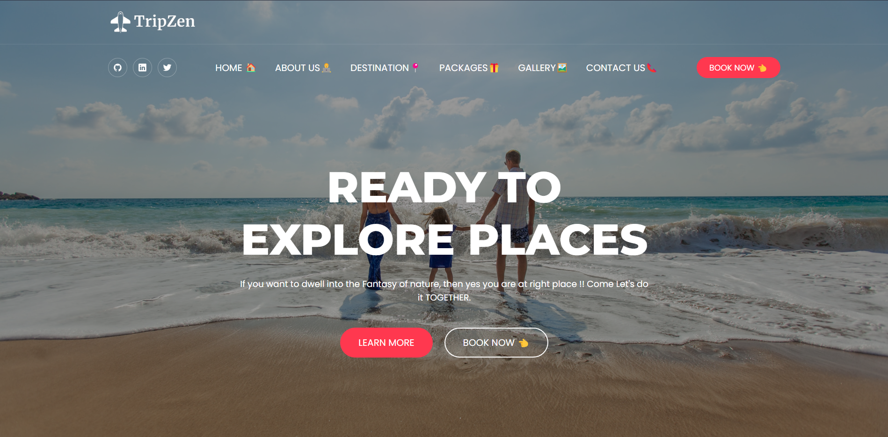
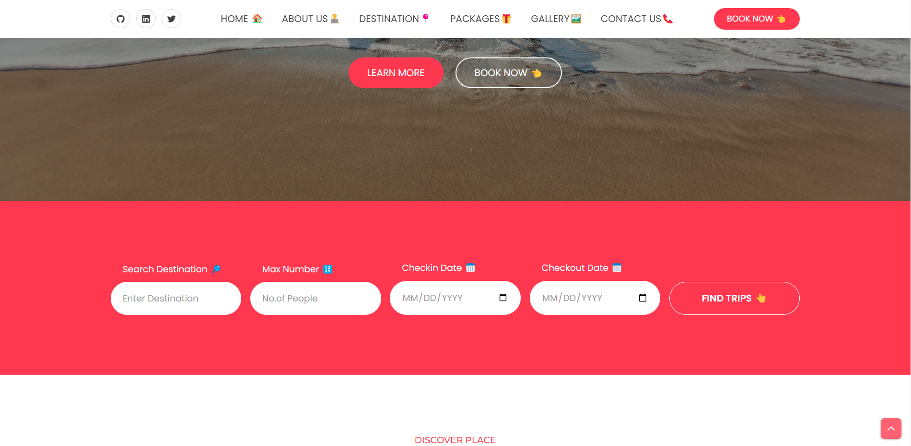
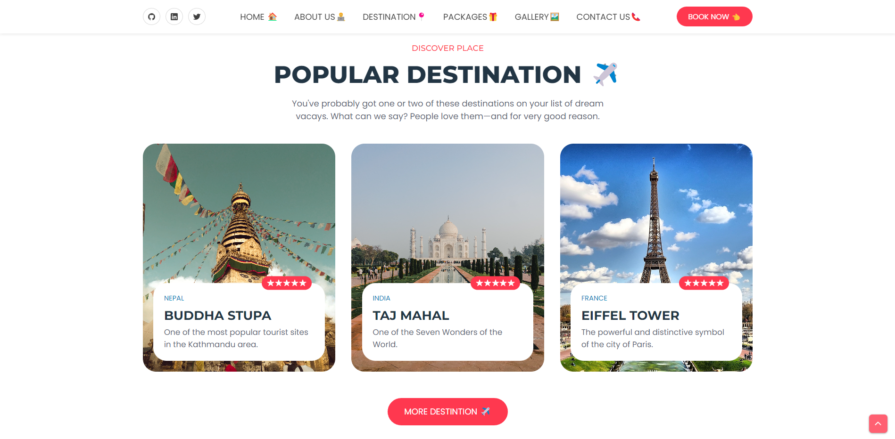
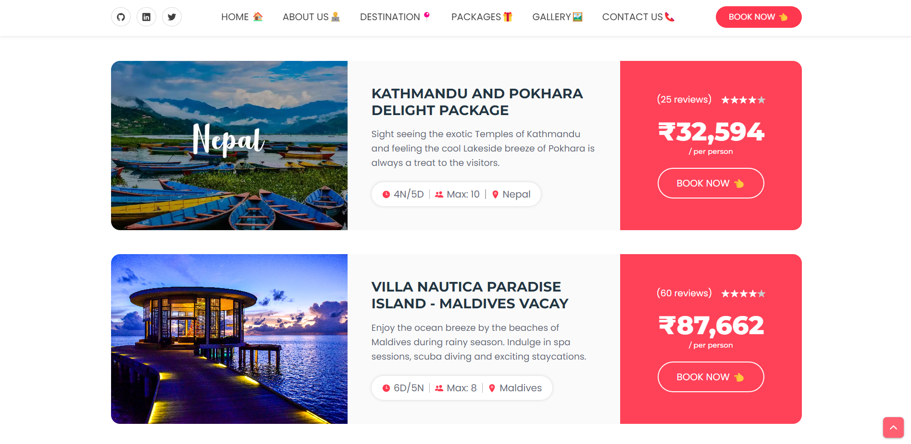
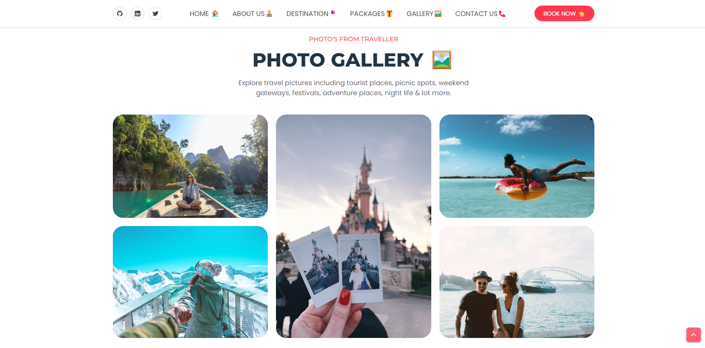
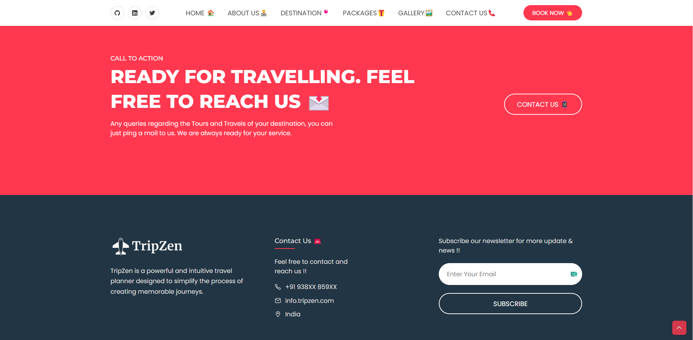

# TripZen: Your Ultimate Travel Planner
> TripZen is a powerful and intuitive travel planner designed to simplify the process of creating memorable journeys. With TripZen, users can effortlessly plan their trips, from selecting destinations and creating itineraries to discovering hidden gems and organizing accommodations. The platform provides a seamless user experience, offering personalized recommendations, real-time updates, and an array of features to enhance the travel planning process.

> Live demo: [_here_](https://aman-chhetri.github.io/TripZen/). <!-- Project Link -->

## Table of Contents
* [Inspiration 💡](#inspirations)
* [What it does ⚙️](#what_it_does)
* [How I built it 🛠️](#built)
* [Challenges I ran into 😓](#challenges)
* [Accomplishments that I am proud of 🏅](#accomplishments)
* [What I learned 🎓](#learning)
* [What's next for TripZen 🔜](#what-next)
* [Screenshots 🖼️](#screenshots)
* [Contact 📩](#contact)

## Inspiration💡
The inspiration behind TripZen was the desire to create a comprehensive travel planner that goes beyond just logistics and itineraries. I wanted to build a platform that embraces the essence of travel, focusing on the transformative and enriching experiences it offers. By combining the concept of finding inner peace and harmony with the excitement of adventure, TripZen aims to inspire individuals to explore the world with a renewed perspective.

## What it does⚙️
TripZen is a powerful and intuitive travel planner designed to simplify the process of creating memorable journeys. With TripZen, users can effortlessly plan their trips, from selecting destinations and creating itineraries to discovering hidden gems and organizing accommodations. The platform provides a seamless user experience, offering personalized recommendations and an array of features to enhance the travel planning process.

## How I built it 🛠️
- TripZen was built using a combination of HTML, CSS, JavaScript, and Bootstrap. The front end was developed with HTML and CSS to create a visually appealing and user-friendly interface. 
- JavaScript was utilized to add dynamic functionality, ensuring smooth interactions and responsiveness. Bootstrap framework was employed to streamline the development process and ensure a consistent and responsive design across different devices.

## Challenges I ran into😓
During the development of TripZen, I faced various challenges. One of the main hurdles was integrating external data sources to gather and display relevant travel information, such as flight details, hotel availability, and tourist attractions. I also encountered difficulties in optimizing the performance and loading speed of the website, considering the large amount of data being processed. However, through collaboration, research, and perseverance, I overcame these obstacles and created a robust and efficient travel planner.

## Accomplishments that I am proud of🏅
I take great pride in the accomplishments achieved while building TripZen. First and foremost, I am proud of successfully combining the concepts of inner peace and adventure into a cohesive and engaging platform. Additionally, I am proud of the seamless integration of various data sources, ensuring that users have access to comprehensive and up-to-date travel information. Lastly, I am proud of creating an intuitive user interface that offers a delightful and personalized experience to travelers.

## What I learned🎓
Throughout the development of TripZen, I gained valuable insights and knowledge. I deepened my understanding of integrating external data sources and working with dynamic content. I also enhanced my skills in front-end web development, leveraging JavaScript and Bootstrap to create an interactive and visually appealing user interface. Furthermore, I learned the importance of user experience design and incorporating personalization to cater to individual preferences.

## What's next for TripZen🔜
The journey for TripZen does not end here. In the future, I am planning to expand the platform by incorporating additional features such as user reviews, travel community forums, and the ability to create and share travel journals. I also aim to enhance the personalization aspect by offering tailored recommendations based on individual preferences and interests. Additionally, I aspire to integrate more travel-related services, enabling users to seamlessly book accommodations, transportation, and activities directly through TripZen. My goal is to continuously improve the platform and empower travelers to embark on extraordinary adventures with ease.

## Screenshots 🖼️

### Search Trip

### Popular Destination

### Packages

### Photo Gallery

### Footer

## Contact 📩
Created by: [@amankshetri](https://www.linkedin.com/in/amankshetri/) - feel free to contact me! 🙂
